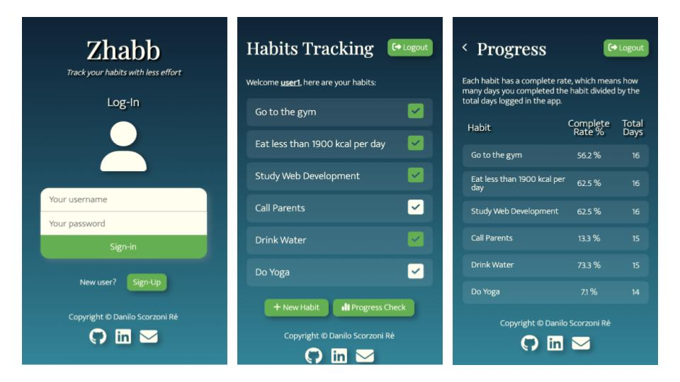
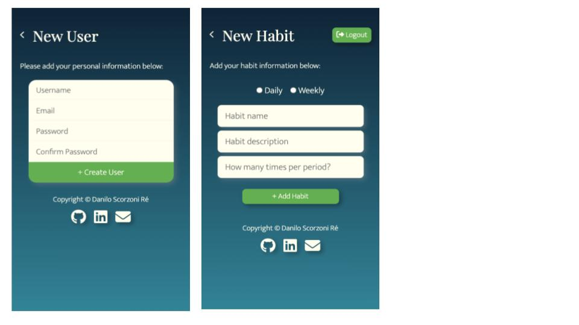

# Zhabb App

This is the repository for the Zhabb App, a learning project to develop a web mobile app that helps track habits.

## Functionalities

- Create a new user and log-in.
- Create a list of habits to be tracked daily.
- Log every day and check habits that you completed.
- Check progress of your habits with complete rate.

## Screenshots

Screenshots below show the login screen, habits tracking and progress pages:

Below the add new user and add new habit pages:

## My Process

### Stack

- Python
- Django + Django Template Language (DTL)
- Semantic HTML5 Markup
- Design with pure CSS, optimized for mobile

### What I learned

- End to end development on Django, putting in practice what I've learned in the [Meta's Certificate on Backend Development](https://www.coursera.org/account/accomplishments/professional-cert/Z8JBYWQGXZXU).
- Unit testing implementation for Django.

### Live Version

You can access this app deployed in Azure App Services. Note that this is using the free tier, so the first access may take longer to load (~1 minute):

[https://zhabb-app.azurewebsites.net/](https://zhabb-app.azurewebsites.net/)

## Contacts

- Frontend Mentor - [@dscorzoni](https://www.frontendmentor.io/profile/dscorzoni)
- Linkedin - [@dscorzoni](https://www.linkedin.com/in/dscorzoni/)
